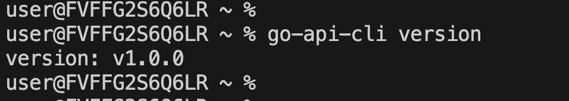
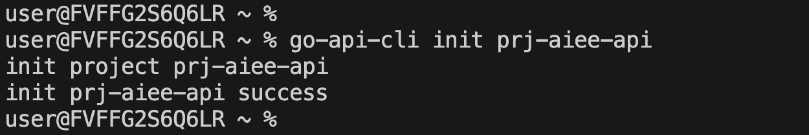
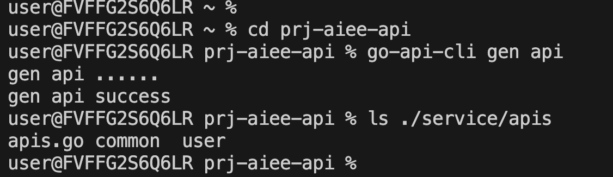
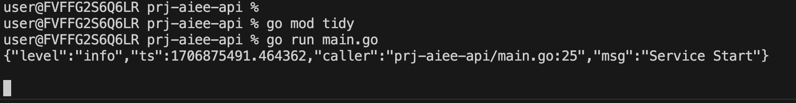

# github.com/liyonge-cm/go-api-cli

Author:liyonge(aiee)

根据表结构直接自动化生成各个表的CRUD，增加(Create)、读取(Read)、更新(Update)和删除(Delete)。

## API规则
首先建立好规则，方便生成逻辑统一的CRUD：

### 1.数据库表结构规则
1. id为int类型自增数值
2. 都有创建、更新时间，字段名固定为created_at,updated_at，且为int64类型，存值为时间戳
3. 都有状态字段，字段名固定为status，int类型，初始值为0，删除为-1

### 2.CRUD规则
1. Create时，除了id、status,created_at,updated_at，其他字段都作为入参，入库时初始status为0，创建、更新时间为当前时间戳
2. Read时，带分页功能，分页参数统一为：limit（每页条数）、offset（第几页，从1开始），响应所有表字段原始数据
3. Update时，必传id参数，除status,created_at,updated_at外的其他字段都可更改，更新时间自动设置为当前时间戳
4. Delete时，必传id参数，status设置为-1，更新时间自动设置为当前时间戳

### 3. api 风格

1. API method统一为post，body以json入参。如
```shell
curl -X POST "http://localhost:8080/user/getList" -H  "accept: application/json" -d "{\"limit\": 10,\"offset\": 1}" 
```

2. 入参json支持camel-驼峰，snake-下划线，默认snake。

3. 以表名作为group，crud分别为create,get,getList,update,delete。
如有一个表名为user，生成API请求地址分别为：
- http://localhost:8080/user/create 
- http://localhost:8080/user/get 
- http://localhost:8080/user/getList 
- http://localhost:8080/user/update 
- http://localhost:8080/user/delete 


## cli使用

步骤：
1. 下载安装go-api-cli
2. 生成项目
3. 启动数据库并按规则创建库表
4. 根据库表生成API
5. 启动项目调用API

### 1.下载安装

1. go install 下载安装
```shell
# go安装
go install github.com/liyonge-cm/go-api-cli@1.0.0

# 验证
go-api-cli version
```




2. 源码安装

```shell
# 拉取源码
git clone https://github.com/liyonge-cm/go-api-cli

# 编译
go build

# 将编译后的go-api-cli文件放至环境变量path下

# 验证
go-api-cli version
```

### 2.创建API项目

在当前目录下生成项目，名称为prj-aiee-api
```shell
go-api-cli init prj-aiee-api
```
执行成功后可以看到新生成的项目框架



也可以指定目录生成
```shell
go-api-cli init ./prj/prj-aiee-api
```

默认生成的API参数格式是snake，如需指定为camel
```shell
go-api-cli init prj-aiee-api -j camel
```

此时项目框架已经完全搭建起来了，具体的API要根据数据库的表来生成，所以下一步先创建库表，之后修改项目数据库连接，再生成API运行项目。

### 3.按规则创建库表

创建表的规则上面已经提到，这里给个示例：user 用户信息表
```sql
CREATE TABLE `user` (
  `id` int NOT NULL AUTO_INCREMENT COMMENT '自增ID',
  `name` varchar(20) NOT NULL COMMENT '姓名',
  `age` int NOT NULL COMMENT '年龄',
  `status` tinyint(1) NOT NULL COMMENT '状态',
  `created_at` bigint DEFAULT NULL COMMENT '创建时间',
  `updated_at` bigint DEFAULT NULL COMMENT '更新时间',
  PRIMARY KEY (`id`)
) ENGINE=InnoDB AUTO_INCREMENT=1 COMMENT='用户信息表'
```

### 4.根据库表生成API

1. 修改项目中的配置文件，config/config.yml。配置说明：
```yml
service:
  port: 服务端口

frame:
  out_path: 项目文件所在位置
  prj_name: 项目名称
  json_case: api入参处参的json格式：camel-驼峰，snake-下划线，默认下划线

api:
  tables: 指定要生成API的表名
    - user 

mysql: mysql连接配置

```

这里主要需要修改mysql连接配置，其他保持原样即可。
注意：tables是要生成API的表名，如果为空默认生成数据库内的所有表。

2. 生成API

在项目文件下执行cli -g命令，将生成配置文件中指定表的API组
```shell
# 进入项目文件
cd prj-aiee-api

# 生成API
go-api-cli gen api
```

执行成功后会在项目的service/api/下生成以表名命名的文件及相关代码



也可以用cli -t指定表，表名可以是一个或多个，多个用英文逗号分隔。
在cli指定来表的情况下，忽略配置文件指定的表。

```shell
go-api-cli gen api -t user
```

### 5.启动项目

1. 启动项目

在项目文件下执行go命令
```shell
# 1. 下载依赖包: 
go mod tidy

# 2. 启动: 
go run main.go

```




此时API项目成功运行，就可以直接调用API来对数据库就行增删改查操作了。

2. 调用API

假设我们新建一个名为aiee，芳龄18的用户
```shell
# 1. 创建user
curl -X POST "http://localhost:8080/user/create" -H  "accept: application/json" -d "{\"name\": \"aiee\",\"age\": 18}" 

# 2. API调用，获取user数据列表
curl -X POST "http://localhost:8080/user/getList" -H  "accept: application/json" -d "{\"limit\": 10,\"offset\": 1}" 

```
我看到创建成功后，获取列表可以查询刚刚新建的用户信息


